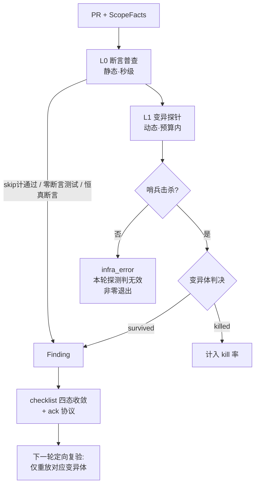
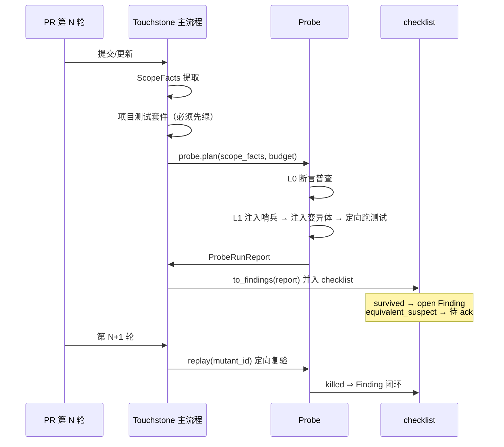

# Touchstone Probe（测试有效性探针）设计文档

## 1. 设计目的

### 1.1 定性

本设计是**在已有系统（Touchstone）中增加一个功能模块**，不是新系统。新增模块名为 **Probe（测试有效性探针）**，职责是回答一个 Touchstone 现有能力回答不了的问题：

> **"测试全绿"这件事本身可信吗？**

### 1.2 现状建模

Touchstone 当前的审查闭环（锚定于 2026-07-27 的仓库状态：AKDI-SE/touchstone，设计文档 §3.9–3.12 已更新，469 个测试离线全通过）：

```
PR 提交
  → ScopeFacts 提取（确定性的第三方客观锚点）
  → AI 审查产出 Finding（fix_direction / fix_reasoning / done_criteria）
  → checklist.py 四态收敛 + ack 协议
  → lineage.py 内容指纹轮次记账
  → review_report.md 输出
```

这个闭环验证的是**代码是否满足审查意见**。它有一个隐含前提：项目自带的测试套件是有效的护栏——测试绿了，行为就是被保护的。

这个前提在实践中已被证伪两次：

1. **AKDI SETools 实证**（2026-07 两轮代码质量分析）：lint 工具 fail-open（零文件检查、恒 exit 0）；冒烟测试 63 条断言中 11 条带 skip 标记却被计为通过。围栏存在，但不咬人。
2. **外部佐证**（dev-loop 实战报告的三个事故）：suggest 接口价格全返 null，80 个测试全绿——错的不是某一行代码，而是**缺失的断言**；逐行 diff 审查在结构上无法发现这类问题，变异探针一跑即现。

结论：Touchstone 的审查对象目前只有"代码相对于意见"，缺少"测试相对于行为"这一层。在 AI 大量生成代码和测试的场景下，这一层恰恰是最容易溃烂的——AI 生成的测试形态上完整、执行上通过、断言上空心，是"分支多、改动牵一发、测试没守住"的高危形态。

### 1.3 设计期望

在 Touchstone 中新增 Probe 模块，达成：

1. **量化测试有效性**：对 PR 增量范围内的代码做变异探测，暴露"跑过了但没断言"的假测试。
2. **接入现有收敛机制**：探测结果转化为标准 Finding，进入四态 checklist 收敛与 ack 协议，不另起一套报告体系。
3. **自身抗 fail-open**：探针必须能区分"运行了且没发现问题"与"根本没有真正运行"。这是从 AKDI lint 事故中提炼的硬约束，也是对"谁来审计围栏"问题的工程回答。

### 1.4 明确不做的事（边界）

- **不做全量变异测试**。全库穷举变异是另一种成本灾难，与"探针"语义相悖。Probe 是抽样的、有预算的、锚定在 diff 上的。
- **不替代测试运行器**。Probe 复用项目在 Touchstone 配置中声明的测试命令，不自行发现/调度测试。
- **不自动修测试**。survived 变异体产出 Finding（修复方向指向补断言/补场景），修复动作仍由 PR 作者（人或 agent）完成——Probe 是立法与审计侧，不是执行侧。

---

## 2. 设计逻辑

### 2.1 概念空间

为描述本设计引入以下新概念（按解决问题的顺序产生）：

| 概念 | 定义 | 封装的复杂性 |
|---|---|---|
| **探针计划（ProbePlan）** | 一次探测要生成哪些变异体的确定性计划，由 ScopeFacts + 预算推导 | 封装"在哪里变异、变异多少"的选择策略 |
| **变异体（Mutant）** | 一个最小语义扰动实例：位置 + 算子 + 原文/变体片段 | 封装单点扰动的可复现描述 |
| **判决（Verdict）** | 单个变异体的运行结论：`killed / survived / timeout / infra_error / equivalent_suspect` | 封装"测试咬没咬人"的判定 |
| **哨兵变异体（Sentinel）** | 一个构造上必然会被现有测试击杀的变异体，用于自检探针链路 | 封装 fail-open 检测：哨兵存活 ⇒ 本次探测无效 |
| **有效性缺陷（EffectivenessFinding）** | 由 survived 变异体转化的标准 Finding，done_criteria 为"该变异体被击杀" | 封装探测结果到收敛机制的映射 |
| **探针预算（ProbeBudget）** | 变异体数量上限 + 单变异体超时 + 总时长上限 | 封装成本控制 |
| **断言普查（AssertionCensus）** | 运行变异前的静态测试体检：断言密度、skip 标记、恒真断言 | 封装廉价的静态前置筛查 |

### 2.2 分层结构

Probe 内部分两层，静态先行、动态兜底：



**L0 断言普查（静态）**：不运行任何测试，直接静态分析测试文件。检查项直接对标 AKDI 实证的失效模式：

- skip / xfail 标记的用例是否被计入通过口径（AKDI 冒烟测试 11/63 事故的直接翻译）；
- 触及改动代码的测试中，断言数为 0 或只有 `assert True` / `assertIsNotNone(response)` 类恒真、弱断言的用例；
- 测试函数捕获了异常却不 re-raise（吞错型测试）。

L0 成本接近零，能拦住最粗的假测试，并为 L1 的目标选择提供优先级信号。

**L1 变异探针（动态）**：在预算内对 diff 范围代码注入最小语义扰动，重跑相关测试，看测试是否失败。

### 2.3 核心问题与取舍

#### 问题一：变异范围——全库还是增量？

**选择：增量优先，锚定 ScopeFacts。** 变异目标只取 PR diff 覆盖的函数（由 ScopeFacts 提供确定性的文件/函数清单），在预算内按优先级排序：分支数高 × L0 断言密度低的函数优先。

**否决全库模式的理由**：全库变异的成本是 O(变异体数 × 测试套件时长)，在审查轮次的关键路径上不可接受；且全库存量问题属于"基线治理"，与单 PR 审查是两个节奏。全库模式留作 M2 的独立离线基线任务（配合 kill 率棘轮），不进入 PR 审查路径。

**否决"只静态不动态"的理由**：L0 抓不住"有断言但断错了对象"的测试（dev-loop 价格 null 事故里，测试有断言，断的却不是价格值）。动态扰动是唯一能证明"测试与行为绑定"的手段。

#### 问题二：探测结果如何进入闭环——独立报告还是标准 Finding？

**选择：转化为标准 Finding，完全复用四态收敛与 ack 协议。**

- survived 变异体 → Finding：`fix_direction` = "为 X 函数补充断言/场景，使该扰动可被检测"；`done_criteria` = "变异体 {id} 被击杀"。
- **done_criteria 是机器可验证的**：下一轮不需要重新全量探测，只需重放该变异体（一次定向测试运行），击杀即闭环。这使 Probe 类 Finding 的复验成本远低于普通 Finding，且判定无歧义。
- `equivalent_suspect`（疑似等价变异体，怎么补测试都杀不掉）走 ack 协议由人裁决豁免——这正是"裁例外"角色的既有通道，不需要新机制。
- 变异体身份 = `content_fingerprint(文件相对路径 + 函数签名 + 算子 + 位点局部上下文)`，接入 lineage.py 轮次记账：代码未变则指纹稳定，跨轮可追踪；代码变了指纹失效，自然触发重新探测。

**否决独立报告的理由**：另起一套状态机会制造第二收敛点，且丧失 ack/豁免/轮次记账等已验证的机制。Touchstone 的价值就在收敛闭环，Probe 应是闭环的新输入源，不是旁路。

#### 问题三：探针自身的 fail-open 防御

这是本设计的灵魂问题——AKDI 的 lint 工具证明了"围栏本身可以是假的"。Probe 用四重机制保证"never silent"：

1. **哨兵变异体**：每次探测开始时，从计划中挑选一个已被现有测试明确覆盖的位点（L0 普查可给出候选：断言密度最高的函数），注入哨兵扰动。哨兵必须被击杀；哨兵存活 ⇒ 探针链路本身有故障（测试没真跑、变异没真注入、判决逻辑错），本轮判决全部作废，产出 `infra_error` 并**非零退出**。
2. **零变异体 = 错误**：ProbePlan 为空（diff 内无可变异目标）必须显式产出 `plan_empty` 结论并说明原因，绝不允许"没做事但绿灯"——这是对 AKDI"零文件检查、恒 exit 0"的直接反义设计。
3. **判决态完备**：Verdict 五态穷尽所有运行结局，`infra_error`（构建失败、注入失败、环境异常）与 `survived` 严格区分，前者不产生 Finding 而是使本轮探测无效。
4. **RunReport 强制计数**：报告必须包含 计划数/执行数/各判决计数/哨兵结果，任何计数缺失视为报告非法。（与 Scout 的"never silent"RunReport 原则同源。）

#### 问题四（无取舍，简述结论）：变异算子集

采用最小高价值集，全部基于 Python 标准库 `ast` 实现，零第三方依赖（符合离线自包含约束，不引入 mutmut/cosmic-ray）：

| 算子 | 扰动 | 针对的缺陷形态 |
|---|---|---|
| CMP | `<`↔`<=`，`==`↔`!=`，`>`↔`>=` | 边界条件无断言 |
| BOOL | `and`↔`or`，删除 `not` | 分支逻辑无断言 |
| CONST | 整型常量 ±1，非空字符串→`""` | 魔数/默认值无断言 |
| RET | `return x` → `return None` | 返回值无断言（dev-loop 价格 null 事故的直接模拟） |
| EXC | 删除 `raise` 语句 | 异常路径无断言 |

引擎以 `MutationEngine` 接口做语言插件化：M1 仅 Python；Go（akdi-cli）引擎为 M2 预留接缝，不在本设计内展开。

### 2.4 在审查轮次中的位置



前置条件：**测试套件先绿，Probe 才运行**。测试都不绿时谈测试有效性没有意义，且避免把套件失败误判为击杀。

---

## 3. 核心数据结构

围绕"一次探测"组织，与 2.1 概念空间一一对应：

```python
@dataclass(frozen=True)
class ProbeBudget:
    max_mutants: int = 30          # 单次探测变异体上限
    per_mutant_timeout_s: int = 120
    total_timeout_s: int = 1200

@dataclass(frozen=True)
class Mutant:
    mutant_id: str                 # content_fingerprint(path+func_sig+operator+site_ctx)
    path: str                      # 仓库相对路径
    func_sig: str
    operator: str                  # CMP / BOOL / CONST / RET / EXC / SENTINEL
    site: SourceSpan               # 行列区间
    original: str                  # 原片段
    mutated: str                   # 变体片段
    is_sentinel: bool = False

class VerdictKind(Enum):
    KILLED = auto()
    SURVIVED = auto()
    TIMEOUT = auto()               # 计入 survived 口径前需人工确认，默认按 suspect 处理
    INFRA_ERROR = auto()           # 构建/注入/环境失败，本变异体判决无效
    EQUIVALENT_SUSPECT = auto()    # 多轮补测仍存活，走 ack 豁免

@dataclass(frozen=True)
class Verdict:
    mutant_id: str
    kind: VerdictKind
    killing_test: str | None       # 击杀者；KILLED 时必填（下方硬校验）
    elapsed_s: float

    def __post_init__(self):
        # 不变量硬校验：KILLED 必有击杀者标识（判决来源可追溯）。
        # 注释约定升级为结构约束，违反即抛错——与抗 fail-open 立场一致。
        if self.kind is VerdictKind.KILLED and not self.killing_test:
            raise ValueError(f"Verdict 不变量违反：KILLED 判决必须携带 killing_test（mutant={self.mutant_id}）")

@dataclass(frozen=True)
class CensusIssue:                 # L0 产物
    kind: str                      # skip_counted_as_pass / zero_assertion / trivial_assertion / swallowed_exception
    test_path: str
    test_name: str
    evidence: str

class ReportStatus(str, Enum):     # 三态完备（做了/没得做/做废了）；str 混入兼容字面量比较。
    OK = "ok"                      # 普通 str 状态机在条件判断中拼写错误会静默失效——
    PLAN_EMPTY = "plan_empty"      # 结构化枚举从类型上杜绝非法状态值。
    INVALID = "invalid"

@dataclass(frozen=True)
class ProbeRunReport:              # never-silent 强制载体
    plan_size: int                 # 计划变异体数；0 时 status 必为 PLAN_EMPTY
    executed: int
    sentinel_result: VerdictKind   # 必须为 KILLED，否则 status=INVALID
    verdicts: tuple[Verdict, ...]  # tuple：frozen 只冻结字段绑定不冻结容器内容，
    census: tuple[CensusIssue, ...]  #   tuple 使不可变契约在容器层成立
    status: ReportStatus           # OK / PLAN_EMPTY / INVALID
    kill_rate: float | None        # killed / (killed + survived)，INVALID 时为 None

    def __post_init__(self):
        # 构造入参宽容接受任意序列，落位即归一为 tuple——消费方无法事后篡改判决。
        object.__setattr__(self, "verdicts", tuple(self.verdicts))
        object.__setattr__(self, "census", tuple(self.census))
        object.__setattr__(self, "status", ReportStatus(self.status))   # 字面量 → 枚举归一
        # 报告自身不变量硬校验（与 Verdict 同款）：矛盾报告不允许被构造。
        if self.plan_size == 0 and self.status is not ReportStatus.PLAN_EMPTY:
            raise ValueError("plan_size==0 时 status 必为 PLAN_EMPTY")
        if self.status is ReportStatus.OK and self.sentinel_result is not VerdictKind.KILLED:
            raise ValueError("status=OK 要求哨兵 KILLED（链路自检未过不得报 ok）")
        if self.status in (ReportStatus.INVALID, ReportStatus.PLAN_EMPTY) and self.kill_rate is not None:
            raise ValueError("INVALID/PLAN_EMPTY 报告不得携带 kill_rate")
```

关联关系：`ProbePlan`（ScopeFacts × Budget → list[Mutant]）是输入侧计划；`ProbeRunReport` 是输出侧唯一真相载体；`to_findings()` 消费 Report 产出标准 Finding，Finding 中携带 `mutant_id` 作为与 lineage.py 对接的指纹。

## 4. 接口定义

```python
def plan(scope_facts: ScopeFacts, budget: ProbeBudget,
         census: list[CensusIssue]) -> list[Mutant]:
    """由 ScopeFacts 圈定的增量函数集生成探针计划：按（分支数 × 低断言密度）
    降序选点，套用算子集，截断到 budget.max_mutants，并追加一个哨兵变异体。
    计划为空不是异常，但必须由调用方转写为 plan_empty 报告。"""

def census(scope_facts: ScopeFacts) -> list[CensusIssue]:
    """L0 断言普查：静态扫描触及增量代码的测试，产出 skip 计通过/零断言/
    恒真断言/吞错四类问题。不运行测试。"""

def run(mutants: list[Mutant], test_cmd: TestCommand,
        budget: ProbeBudget, census_issues: list[CensusIssue]) -> ProbeRunReport:
    """逐个注入变异体、运行定向测试、恢复源码、记录判决。哨兵最先执行，
    哨兵未被击杀立即终止并返回 status=invalid；非空计划无哨兵同样 status=invalid
    （链路自检不可用即无效，绝不允许「没自检但绿灯」）。任何路径都产出完整计数。
    census_issues 为必传（无问题显式传 []）：L0 结果是静态 Finding 的核心来源，
    可选默认极易被调用方遗漏而静默丢失整层检测——never silent 同样约束接口形态。"""

def replay(mutant: Mutant, test_cmd: TestCommand,
           budget: ProbeBudget | None = None) -> Verdict:
    """定向复验单个变异体，用于下一轮验证 Probe 类 Finding 的 done_criteria。
    成本为一次测试运行，不触发全量探测。参数取整个 Mutant 而非仅 mutant_id：
    注入编辑需要 original/mutated/site，仅凭指纹无法重建（见 §5 遗留项④）。"""

def to_findings(report: ProbeRunReport) -> list[Finding]:
    """survived → open Finding（fix_direction=补断言/补场景，done_criteria=
    击杀 mutant_id）；census 问题 → 对应静态类 Finding；
    equivalent_suspect → 待 ack Finding。invalid 报告不产出 Finding，
    而是产出一条针对探针链路本身的 P0 Finding。"""
```

CLI 面（并入 touchstone 现有命令风格；**交付边界：本轮（PR #133）仅交付库接口，
CLI 接线为 M-next 交付项**，避免「文档声明、代码悬空」的 AKDI 式失效）：

```
touchstone probe --scope <scope_facts.json> [--budget-mutants 30] [--report probe_report.json]   # M-next
touchstone probe replay --mutant-id <id>                                                          # M-next
```

**接口关系总结**：一轮审查中，先 `census()` 做静态体检，其结果既直接转 Finding 又作为 `plan()` 的选点信号；`plan()` 依据 ScopeFacts 与预算产出含哨兵的变异体清单；`run()` 执行清单并产出 never-silent 的 `ProbeRunReport`；`to_findings()` 把报告并入 checklist 收敛。下一轮对每个未闭环的 Probe 类 Finding 调 `replay()` 定向复验，击杀即闭环——探测的重成本只在首轮发生，复验是轻量的。

## 5. 一致性校验

- **概念一致性**：全文"变异体/判决/哨兵/普查"术语唯一；"探针"仅指 Probe 模块整体，不与单个变异体混用。已修正初稿中"探针存活"的歧义表述为"变异体存活"。
- **状态完备性**：Verdict 五态覆盖运行的全部结局；TIMEOUT 不直接计入 survived（避免把慢测试误判为假测试），归入 suspect 流走 ack——这是校验中发现并修正的一处漏洞。ProbeRunReport.status 三态（ok/plan_empty/invalid）覆盖"做了/没得做/做废了"，不存在第四种沉默态。
- **接口完备性**：设计逻辑中的每个动作（普查、计划、执行、复验、转 Finding）均有对应接口；哨兵不单独暴露接口，由 plan/run 内聚处理（外部无需感知哨兵的选取）。
- **层次一致性**：Probe 不承担测试调度（复用 TestCommand）、不承担收敛状态管理（复用 checklist）、不承担轮次记账（复用 lineage 指纹机制），仅新增"测试有效性判定"这一层职责。
- **有意接受的遗留项**：① 等价变异体无自动判定，依赖 ack 人裁，理由：等价性判定在理论上不可判定，工程上人裁成本可控且已有通道；② 变异注入采用源码原地替换+恢复而非 AST 重写整文件，崩溃恢复依赖 run() 的 finally 保护与 git 工作区校验，理由：保持字节级最小 diff，便于哨兵与判决的可解释性；③ Go 引擎、全库基线棘轮均推迟至 M2；④ `replay` 以 `Mutant` 为参数而非 `mutant_id`——注入编辑依赖 original/mutated/site，仅存指纹则需要持久化变异体存储才能重建，M1 选择由调用方（checklist 携带的 Finding 上下文）保存 Mutant 对象，避免引入存储层。

## 6. 变更历史

| 日期 | 变更内容 | 原因 |
|---|---|---|
| 2026-07-27 | 初版：L0 断言普查 + L1 变异探针分层设计，哨兵变异体 fail-open 防御，Finding/lineage 闭环接入 | 对标 dev-loop 变异探针实践与 AKDI fail-open 实证，补齐 Touchstone"测试有效性"审查层 |
| 2026-07-27 | R2（PR #133 round-1 销项）：§4 run/replay 签名与实现对齐；补「非空计划无哨兵 ⇒ invalid」语义；CLI 标注 M-next 交付边界；§5 补遗留项④ | R1-01/R1-05/R1-06 评审意见闭环 |
| 2026-07-27 | R3（PR #134 round-1 销项）：Verdict「KILLED 必有 killing_test」升级为 __post_init__ 硬校验；status 改 ReportStatus(str,Enum)；run() 的 census_issues 改必传 | touchstone 评审 3 条意见闭环（不变量/枚举/必传） |
| 2026-07-27 | R4（PR #134 round-2 销项）：§3 补 Verdict.__post_init__ 实体（规范可直接实现、无歧义）；verdicts/census 改 tuple + 构造归一（frozen 契约覆盖容器层） | 193 复核意见 + 212 新意见闭环 |
| 2026-07-27 | R5（PR #134 round-3 销项）：ProbeRunReport.__post_init__ 补三条报告级不变量硬校验 + status 字面量→枚举归一 | 228 意见闭环（矛盾报告不允许被构造） |
